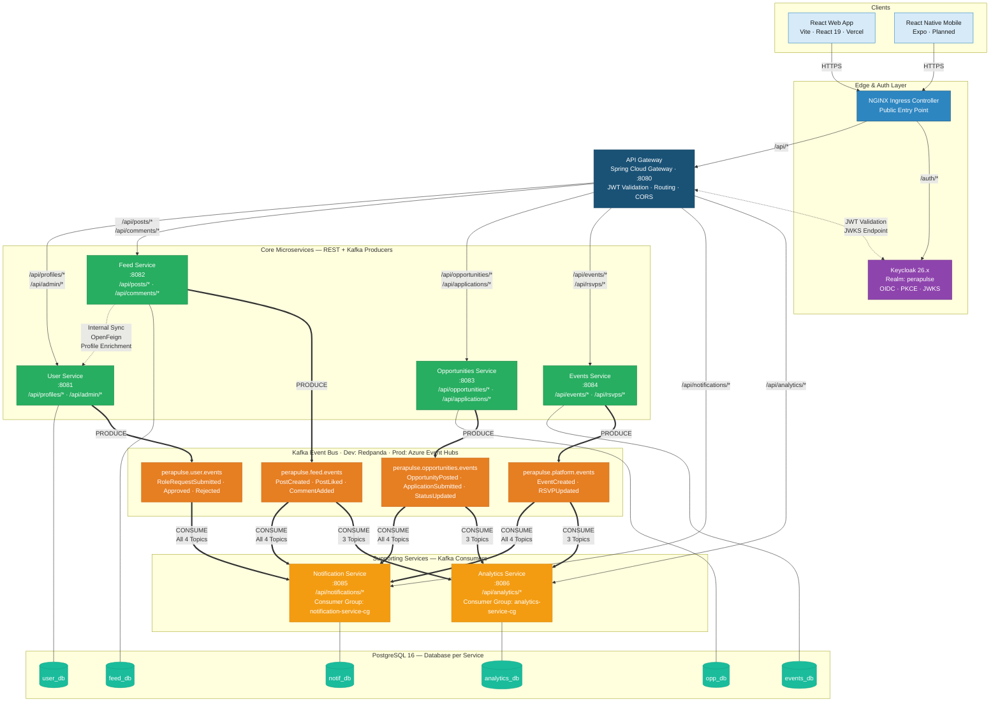
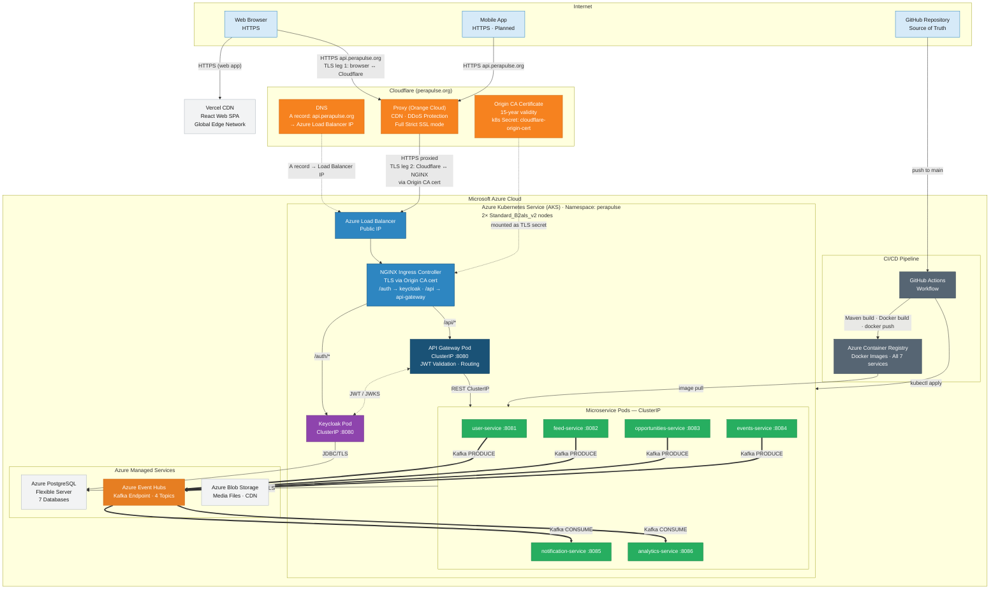

# PeraPulse

**Department Engagement & Career Platform** — CO528 Applied Software Architecture Mini Project
University of Peradeniya, Department of Computer Engineering

---

## Overview

PeraPulse connects current students and alumni of the Department of Computer Engineering through a unified platform for social engagement, career opportunities, and departmental events.

| Module | Features |
|--------|---------|
| Social Feed | Posts, comments, likes |
| Career Hub | Post and apply for jobs & internships |
| Events | Department events with RSVP |
| Notifications | Event-driven in-app alerts |
| Analytics | Admin dashboard with platform metrics |
| Identity & Access | Student / Alumni / Admin roles via Keycloak |

---

## Architecture

### SOA Diagram — Service Interactions & API Endpoints



*Figure 1: Service-Oriented Architecture of PeraPulse, illustrating the seven microservices, synchronous REST communication via the API Gateway, asynchronous event-driven integration over the Kafka message bus, internal OpenFeign service-to-service calls, and the database-per-service deployment pattern.*

---

### Deployment Diagram — Cloud & Infrastructure



*Figure 4a: Production Cloud Deployment Architecture of PeraPulse on Microsoft Azure, showing the Cloudflare DNS and reverse proxy layer (Full Strict SSL with Origin CA certificate), Azure Kubernetes Service cluster internals (NGINX Ingress, API Gateway, seven microservice pods), and Azure managed services (PostgreSQL Flexible Server, Event Hubs, Blob Storage, Container Registry), with Vercel CDN serving the web frontend and GitHub Actions driving the CI/CD pipeline.*

> Full diagram set (Enterprise Architecture, Product Modularity, Local Dev environment): [`docs/architecture/diagrams/`](docs/architecture/diagrams/)

---

## Tech Stack

| Layer | Technology |
|-------|-----------|
| **Backend** | Java 21 · Spring Boot 3/4 · Spring Cloud Gateway · Spring Security |
| **Frontend (Web)** | React 19 · Vite · Zustand · TanStack Query · shadcn/ui · Tailwind CSS |
| **Frontend (Mobile)** | React Native · Expo (planned) |
| **Auth** | Keycloak 26.x · OIDC · Authorization Code + PKCE |
| **Database** | PostgreSQL 16 · Flyway migrations · Database-per-service |
| **Messaging** | Redpanda (local) · Azure Event Hubs — Kafka endpoint (prod) |
| **Cloud** | Azure Kubernetes Service · Azure PostgreSQL · Azure Blob Storage · ACR |
| **DNS / Proxy** | Cloudflare DNS · Proxy · Full Strict SSL · Origin CA |
| **Web Deployment** | Vercel CDN |
| **CI/CD** | GitHub Actions |
| **API Contracts** | OpenAPI 3.0 · Swagger UI per service |

---

## Repository Structure

```
PeraPulse/
├── services/                    # Spring Boot microservices (Java 21 · Maven)
│   ├── api-gateway/             # Spring Cloud Gateway · JWT validation · routing
│   ├── user-service/            # Profiles · role requests · admin
│   ├── feed-service/            # Posts · comments · likes · Kafka producer
│   ├── opportunities-service/   # Jobs & internships · applications · Kafka producer
│   ├── events-service/          # Events · RSVP · Kafka producer
│   ├── notification-service/    # In-app notifications · Kafka consumer
│   └── analytics-service/       # Platform metrics · admin dashboard · Kafka consumer
├── clients/
│   ├── perapulse-web/           # React 19 + Vite SPA · deployed on Vercel
│   └── mobile/                  # React Native + Expo (planned)
├── infra/
│   ├── k8s/                     # Kubernetes manifests (AKS · namespace: perapulse)
│   ├── docker-compose.yml       # Full local dev stack
│   ├── postgres/init.sql        # Creates 7 databases
│   └── keycloak/                # Realm export (perapulse-realm.json)
├── docs/
│   ├── api/                     # OpenAPI 3.0 YAML specs (one per service)
│   ├── architecture/
│   │   ├── diagrams/            # Mermaid architecture diagrams (Figures 1–4)
│   │   └── aks-deployment-guide.md
│   └── brainstorm/              # Project proposal · report guide · design notes
└── .github/workflows/           # GitHub Actions CI/CD
```

---

## Local Development

### Prerequisites

- Docker + Docker Compose
- Java 21 (Eclipse Temurin recommended)
- Node.js 20+
- Maven 3.9+ (or use the `./mvnw` wrapper in each service)

### 1. Start infrastructure

```bash
docker-compose -f infra/docker-compose.yml up -d
```

Starts: PostgreSQL (port 5433), Keycloak (port 8180), Redpanda (port 9092), Redpanda Console (port 8888)

### 2. Run services

```bash
# From each service directory, e.g.:
cd services/api-gateway && ./mvnw spring-boot:run
```

### 3. Run web client

```bash
cd clients/perapulse-web && npm install && npm run dev
```

### Local access points

| Endpoint | URL |
|----------|-----|
| React Web App | `http://localhost:5173` |
| API Gateway | `http://localhost:8080` |
| Keycloak Admin | `http://localhost:8180/auth/admin` |
| Redpanda Console | `http://localhost:8888` |
| Swagger UI (per service) | `http://localhost:{PORT}/swagger-ui.html` |

---

## Cloud Deployment

- **Domain:** `api.perapulse.org` (Cloudflare DNS + Proxy · Full Strict SSL)
- **Platform:** Azure Kubernetes Service (AKS) · namespace `perapulse`
- **Nodes:** 2× `Standard_B2als_v2`
- **Database:** Azure Database for PostgreSQL Flexible Server (7 databases)
- **Messaging:** Azure Event Hubs (Kafka-compatible endpoint · 4 topics)
- **Registry:** Azure Container Registry (ACR)
- **Media Storage:** Azure Blob Storage
- **Web Frontend:** Vercel CDN

Full step-by-step deployment guide: [`docs/architecture/aks-deployment-guide.md`](docs/architecture/aks-deployment-guide.md)

---

## API Documentation

OpenAPI 3.0 specs in [`docs/api/`](docs/api/). Each service also exposes Swagger UI at `/swagger-ui.html` when running locally.

| Service | Spec | Key Endpoints |
|---------|------|---------------|
| User Service | [user-service.yaml](docs/api/user-service.yaml) | `/api/profiles/*` · `/api/admin/*` |
| Feed Service | [feed-service.yaml](docs/api/feed-service.yaml) | `/api/posts/*` · `/api/comments/*` |
| Opportunities | [opportunities-service.yaml](docs/api/opportunities-service.yaml) | `/api/opportunities/*` · `/api/applications/*` |
| Events | [events-service.yaml](docs/api/events-service.yaml) | `/api/events/*` · `/api/rsvps/*` |
| Notifications | [notification-service.yaml](docs/api/notification-service.yaml) | `/api/notifications/*` |
| Analytics | [analytics-service.yaml](docs/api/analytics-service.yaml) | `/api/analytics/*` |

---

## Architecture Diagrams

Full Mermaid diagrams with captions in [`docs/architecture/diagrams/`](docs/architecture/diagrams/):

| Figure | Diagram | File |
|--------|---------|------|
| Figure 1 | SOA — Service Interactions & API Endpoints | [01_soa_diagram.md](docs/architecture/diagrams/01_soa_diagram.md) |
| Figure 2 | Enterprise Architecture | [02_enterprise_diagram.md](docs/architecture/diagrams/02_enterprise_diagram.md) |
| Figure 3 | Product Modularity | [03_product_modularity_diagram.md](docs/architecture/diagrams/03_product_modularity_diagram.md) |
| Figure 4a | Deployment — Azure Production | [04_deployment_diagram.md](docs/architecture/diagrams/04_deployment_diagram.md) |
| Figure 4b | Deployment — Local Development | [04_deployment_diagram.md](docs/architecture/diagrams/04_deployment_diagram.md) |

---

## Team Roles

| Role | Responsibility |
|------|---------------|
| Enterprise Architect | High-level system vision, module integration, departmental workflow |
| Solution Architect | Service design, API contracts, inter-service communication |
| Application Architect | Feature implementation, client integration, code quality |
| Security Architect | Auth design (Keycloak/OIDC), JWT flow, role-based access |
| DevOps Architect | CI/CD pipeline, AKS deployment, Cloudflare, cloud infrastructure |

---

## Documentation

| Document | Location |
|----------|---------|
| Report Guide & Task Breakdown | [docs/brainstorm/report_guide.md](docs/brainstorm/report_guide.md) |
| Project Proposal & Sprint Plan | [docs/brainstorm/project_proposal.md](docs/brainstorm/project_proposal.md) |
| AKS Deployment Guide | [docs/architecture/aks-deployment-guide.md](docs/architecture/aks-deployment-guide.md) |
| Architecture Diagram Sketches | [docs/architecture/architecture_diagram_sketches.md](docs/architecture/architecture_diagram_sketches.md) |
| Architecture Diagrams (Mermaid) | [docs/architecture/diagrams/](docs/architecture/diagrams/) |
| OpenAPI Specs | [docs/api/](docs/api/) |
