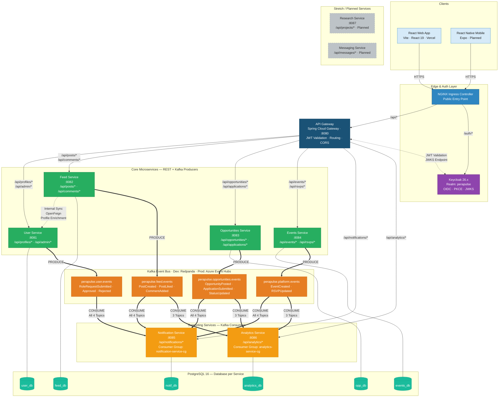

# Diagram 1 — SOA Diagram: Service Interactions & API Endpoints

> Shows every microservice, synchronous REST communication, asynchronous Kafka event flow, and the API endpoints exposed through the API Gateway.



*Figure 1: Service-Oriented Architecture of PeraPulse, illustrating the seven microservices, synchronous REST communication via the API Gateway, asynchronous event-driven integration over the Kafka message bus, internal OpenFeign service-to-service calls, and the database-per-service deployment pattern.*

---

## API Endpoint Reference

| Service | Key Endpoints | Method | Role Required |
|---------|--------------|--------|---------------|
| **User Service** | `/api/profiles/me` | GET, PUT | Any authenticated |
| | `/api/profiles/{sub}` | GET | Any authenticated |
| | `/api/profiles/role-requests` | POST | STUDENT |
| | `/api/admin/users` | GET | ADMIN |
| | `/api/admin/role-requests/{id}/approve` | PUT | ADMIN |
| | `/api/admin/role-requests/{id}/reject` | PUT | ADMIN |
| **Feed Service** | `/api/posts` | GET, POST | Any authenticated |
| | `/api/posts/{id}` | GET, DELETE | Author/ADMIN |
| | `/api/posts/{id}/likes` | POST, DELETE | Any authenticated |
| | `/api/posts/{id}/comments` | GET, POST | Any authenticated |
| **Opportunities Service** | `/api/opportunities` | GET, POST | GET: any; POST: ALUMNI/ADMIN |
| | `/api/opportunities/{id}/apply` | POST | STUDENT |
| | `/api/applications/me` | GET | STUDENT |
| | `/api/applications/{id}/status` | PUT | ALUMNI/ADMIN |
| **Events Service** | `/api/events` | GET, POST | GET: any; POST: ALUMNI/ADMIN |
| | `/api/events/{id}/rsvp` | POST | Any authenticated |
| | `/api/events/{id}/attendees` | GET | ALUMNI/ADMIN |
| **Notification Service** | `/api/notifications` | GET | Any authenticated |
| | `/api/notifications/unread-count` | GET | Any authenticated |
| | `/api/notifications/{id}/read` | POST | Owner |
| | `/api/notifications/read-all` | POST | Any authenticated |
| **Analytics Service** | `/api/analytics/summary` | GET | ADMIN |
| | `/api/analytics/daily` | GET | ADMIN |
| | `/api/analytics/top-posts` | GET | ADMIN |

---

## Kafka Event Payloads Reference

| Topic | Event Type | Key Payload Fields |
|-------|-----------|-------------------|
| `perapulse.feed.events` | `PostCreated` | `postId`, `authorId`, `content`, `timestamp` |
| | `PostLiked` | `postId`, `likerId`, `timestamp` |
| | `CommentAdded` | `postId`, `commentId`, `authorId`, `timestamp` |
| `perapulse.opportunities.events` | `OpportunityPosted` | `opportunityId`, `posterId`, `title`, `type` |
| | `ApplicationSubmitted` | `applicationId`, `applicantId`, `opportunityId` |
| | `ApplicationStatusUpdated` | `applicationId`, `newStatus` |
| `perapulse.platform.events` | `EventCreated` | `eventId`, `organizerId`, `title`, `date` |
| | `RSVPUpdated` | `eventId`, `userId`, `status` |
| `perapulse.user.events` | `RoleRequestSubmitted` | `requestId`, `userId`, `requestedRole` |
| | `RoleRequestApproved` | `requestId`, `userId`, `newRole` |
| | `RoleRequestRejected` | `requestId`, `userId` |

---

## Auth Flow Annotation

```
1. Client  ──PKCE Code Challenge──►  Keycloak
2. Keycloak ──Authorization Code──►  Client
3. Client  ──Code + Verifier──►      Keycloak
4. Keycloak ──JWT (access token)──►  Client
5. Client  ──Bearer <JWT>──►         API Gateway
6. API Gateway ──JWKS lookup──►      Keycloak  (validates signature)
7. API Gateway ──forward + JWT──►    Service
8. Service  ──@PreAuthorize──►       check roles from JWT claims
```
