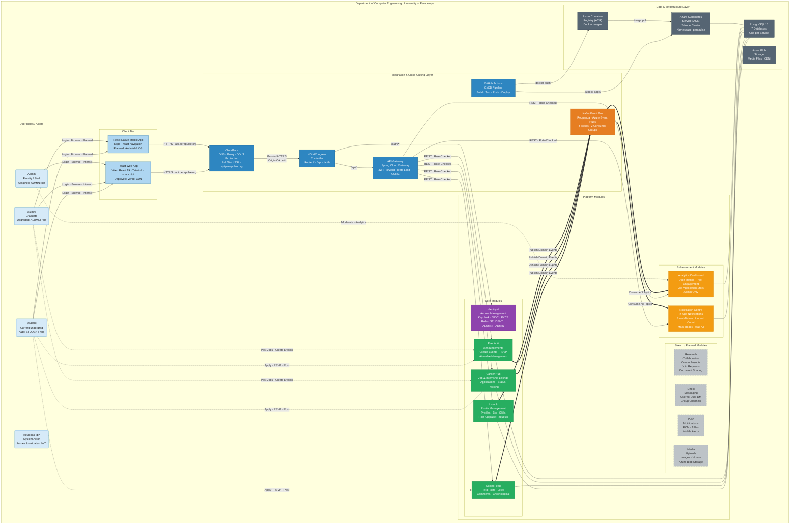

# Diagram 2 — Enterprise Architecture Diagram

> High-level view of actors, organisational roles, platform modules, integration layer, and departmental context. No implementation detail — this represents the business and system-of-systems perspective.



*Figure 2: Enterprise Architecture of the PeraPulse Department Engagement & Career Platform, showing the three user roles (Student, Alumni, Admin), the client tier, core and enhancement platform modules, Cloudflare-fronted integration layer, and the underlying Azure cloud infrastructure within the Department of Computer Engineering, University of Peradeniya.*

---

## Role–Capability Matrix

| Capability | STUDENT | ALUMNI | ADMIN |
|------------|:-------:|:------:|:-----:|
| View feed, events, opportunities | ✅ | ✅ | ✅ |
| Create / delete own posts | ✅ | ✅ | ✅ |
| Like & comment | ✅ | ✅ | ✅ |
| Apply for jobs / internships | ✅ | ❌ | ✅ |
| Post job / internship listings | ❌ | ✅ | ✅ |
| Create events | ❌ | ✅ | ✅ |
| RSVP to events | ✅ | ✅ | ✅ |
| View event attendees | ❌ | ✅ | ✅ |
| Update application status | ❌ | ✅ | ✅ |
| Request alumni role upgrade | ✅ | N/A | N/A |
| Approve / reject role requests | ❌ | ❌ | ✅ |
| Delete any content (moderation) | ❌ | ❌ | ✅ |
| View analytics dashboard | ❌ | ❌ | ✅ |
| Manage users | ❌ | ❌ | ✅ |

---

## Departmental Workflow

```
1. Student enrols in department
       → registers on PeraPulse (auto STUDENT role via Keycloak)
       → builds profile, engages with feed, applies for opportunities

2. Student graduates
       → submits alumni role-upgrade request
       → Admin reviews & approves
       → Keycloak role updated to ALUMNI
       → alumni can now post jobs, create events, view applications

3. Faculty/Staff
       → assigned ADMIN role manually in Keycloak
       → moderate content, manage users, view platform analytics

4. Alumni connect back
       → post career opportunities for current students
       → share industry knowledge via feed
       → organise networking events with RSVP
```
