# Diagram 3 — Product Modularity Diagram

> Shows the layered modular structure: shared foundation, core modules, integration bus, optional enhancements, stretch features, and client tier. Demonstrates independent deployability, reusable contracts, and maintainability design.

```mermaid
flowchart TD

    %% ── Tier 5: Client Layer ────────────────────────────────────
    subgraph T5["Tier 5 · Client Layer"]
        direction LR
        CW["React Web App\nVite · React 19 · Zustand · TanStack Query\nShadcn/ui · Tailwind CSS · Vercel CDN"]
        CM["React Native Mobile\nExpo · react-navigation\nPlanned: Android & iOS"]
    end

    %% ── Tier 0: Shared Foundation ───────────────────────────────
    subgraph T0["Tier 0 · Shared Foundation — All Modules Depend On This"]
        direction LR
        GW["API Gateway\nSpring Cloud Gateway · :8080\nJWT Forwarding · CORS · Routing"]
        AUTH["Keycloak 26.x\nOIDC · PKCE · JWKS\nRoles: STUDENT · ALUMNI · ADMIN"]
        ENV["Common Event Envelope\nJSON Schema:\neventId · eventType · timestamp · producer · topic · data"]
        DPS["Database per Service\nPostgreSQL 16\nOne schema per service\nNo cross-service DB access"]
    end

    %% ── Tier 1: Core Modules ────────────────────────────────────
    subgraph T1["Tier 1 · Core Modules — Must Have"]
        direction LR

        subgraph USM["User & Profile"]
            US_SVC["user-service · :8081"]
            US_DB[("user_db\nuser_profile\nrole_request")]
            US_API["APIs:\n/api/profiles/*\n/api/admin/*"]
            US_EVT["Publishes:\nperapulse.user.events"]
        end

        subgraph FSM["Social Feed"]
            FS_SVC["feed-service · :8082"]
            FS_DB[("feed_db\npost\ncomment\npost_like")]
            FS_API["APIs:\n/api/posts/*\n/api/comments/*"]
            FS_EVT["Publishes:\nperapulse.feed.events"]
        end

        subgraph OSM["Career Hub"]
            OS_SVC["opportunities-service · :8083"]
            OS_DB[("opp_db\nopportunity\napplication")]
            OS_API["APIs:\n/api/opportunities/*\n/api/applications/*"]
            OS_EVT["Publishes:\nperapulse.opportunities.events"]
        end

        subgraph ESM["Events"]
            ES_SVC["events-service · :8084"]
            ES_DB[("events_db\nevent\nrsvp")]
            ES_API["APIs:\n/api/events/*\n/api/rsvps/*"]
            ES_EVT["Publishes:\nperapulse.platform.events"]
        end
    end

    %% ── Tier 2: Integration Layer ───────────────────────────────
    subgraph T2["Tier 2 · Integration Layer — Kafka Event Bus"]
        direction LR
        KT1["perapulse.feed.events\nPostCreated · PostLiked · CommentAdded"]
        KT2["perapulse.opportunities.events\nOpportunityPosted · ApplicationSubmitted · StatusUpdated"]
        KT3["perapulse.platform.events\nEventCreated · RSVPUpdated"]
        KT4["perapulse.user.events\nRoleRequestSubmitted · Approved · Rejected"]
    end

    %% ── Tier 3: Optional Enhancement Modules ───────────────────
    subgraph T3["Tier 3 · Enhancement Modules — Should Have"]
        direction LR

        subgraph NSM["Notification Centre"]
            NS_SVC["notification-service · :8085"]
            NS_DB[("notif_db\nnotification")]
            NS_API["APIs:\n/api/notifications/*"]
            NS_CON["Consumes:\nAll 4 topics\nnotification-service-cg"]
        end

        subgraph ANM["Analytics Dashboard"]
            AN_SVC["analytics-service · :8086"]
            AN_DB[("analytics_db\nplatform_stats\naggregate_counter")]
            AN_API["APIs:\n/api/analytics/*"]
            AN_CON["Consumes:\n3 topics\nanalytics-service-cg"]
        end
    end

    %% ── Tier 4: Stretch / Future Modules ───────────────────────
    subgraph T4["Tier 4 · Stretch / Future — Could Have"]
        direction LR
        RSM["Research\nCollaboration\nresearch-service · :8087\nProject board · Document sharing\nMember management"]
        MSG["Direct\nMessaging\nmessaging-service\nWebSocket · User-to-user DM\nGroup channels"]
        PUSH["Push\nNotifications\nFCM · APNs\nExtends notification-service\nMobile alerts"]
        MEDIA["Media\nUploads\nAzure Blob Storage\nImages · Videos · Resumes\nCDN delivery"]
    end

    %% ── Reusable Contracts Panel ────────────────────────────────
    subgraph SHARED["Shared Contracts & Conventions — Reused Across All Services"]
        direction LR
        SC1["JWT Bearer Auth\nAll services validate\nvia Spring Security"]
        SC2["Standard Error Envelope\ntimestamp · status\nerror · message · path"]
        SC3["Pagination Contract\n?page=0&size=20\nPage response wrapper"]
        SC4["OpenAPI Spec-First\nSwagger UI per service\n/swagger-ui.html"]
        SC5["Multi-Stage Dockerfile\nMaven build stage\nJRE Alpine runtime"]
        SC6["Flyway Migrations\nVersioned SQL scripts\nsrc/resources/db/migration/"]
    end

    %% ── Flow: Clients → Foundation ──────────────────────────────
    CW & CM -->|"HTTPS · OIDC/PKCE Auth"| AUTH
    CW & CM -->|"REST · Bearer JWT"| GW

    %% ── Flow: Foundation → Core ─────────────────────────────────
    GW -->|"Routes to"| T1

    %% ── Kafka Producers ─────────────────────────────────────────
    US_EVT -->|PRODUCE| KT4
    FS_EVT -->|PRODUCE| KT1
    OS_EVT -->|PRODUCE| KT2
    ES_EVT -->|PRODUCE| KT3

    %% ── Kafka Consumers ─────────────────────────────────────────
    KT1 & KT2 & KT3 & KT4 ==>|CONSUME| NS_CON
    KT1 & KT2 & KT3 ==>|CONSUME| AN_CON

    %% ── Service → DB (internal) ─────────────────────────────────
    US_SVC --- US_DB
    FS_SVC --- FS_DB
    OS_SVC --- OS_DB
    ES_SVC --- ES_DB
    NS_SVC --- NS_DB
    AN_SVC --- AN_DB

    %% ── Internal Sync (OpenFeign) ───────────────────────────────
    FS_SVC -.->|"OpenFeign\nProfile Enrichment\n(bypasses gateway)"| US_SVC

    %% ── Styles ──────────────────────────────────────────────────
    classDef client    fill:#D6EAF8,stroke:#2E86C1,color:#1a1a1a
    classDef foundation fill:#1A5276,color:#fff,stroke:#154360
    classDef core      fill:#27AE60,color:#fff,stroke:#1E8449
    classDef kafka     fill:#E67E22,color:#fff,stroke:#CA6F1E
    classDef optional  fill:#F39C12,color:#fff,stroke:#D68910
    classDef stretch   fill:#BDC3C7,stroke:#95A5A6,color:#2c2c2c,stroke-dasharray:5 5
    classDef shared    fill:#F2F3F4,stroke:#AEB6BF,color:#1a1a1a
    classDef db        fill:#1ABC9C,color:#fff,stroke:#17A589
    classDef keycloak  fill:#8E44AD,color:#fff,stroke:#6C3483

    class CW,CM client
    class GW,ENV,DPS foundation
    class AUTH keycloak
    class US_SVC,FS_SVC,OS_SVC,ES_SVC,US_API,FS_API,OS_API,ES_API,US_EVT,FS_EVT,OS_EVT,ES_EVT core
    class KT1,KT2,KT3,KT4 kafka
    class NS_SVC,NS_API,NS_CON,AN_SVC,AN_API,AN_CON optional
    class RSM,MSG,PUSH,MEDIA stretch
    class SC1,SC2,SC3,SC4,SC5,SC6 shared
    class US_DB,FS_DB,OS_DB,ES_DB,NS_DB,AN_DB db
```

*Figure 3: Product Modularity Architecture of PeraPulse, depicting the five-tier modular structure comprising the shared foundation (API Gateway, Keycloak, event envelope, database-per-service), MoSCoW-classified core and optional modules, the Kafka integration bus, stretch features, and the dual client layer serving both web and mobile consumers through a single unified API surface.*

---

## Modularity Principles Applied

| Principle | How PeraPulse Applies It |
|-----------|--------------------------|
| **Database per Service** | Each service owns its schema. No service reads another service's database directly. |
| **Independent Deployability** | Each service has its own Kubernetes `Deployment` + `Service` manifest. One can be updated/scaled without redeploying others. |
| **Async Decoupling via Kafka** | Core producers (Feed, Opportunities, Events, User) publish domain events without knowing who consumes them. New consumers (future email service, ML pipeline) can be added with zero change to producers. |
| **Contract Stability** | All services share a common JWT format, pagination contract, error envelope, and OpenAPI spec. Clients depend on these stable contracts, not on internal service implementation. |
| **Reusable Build Pattern** | All 7 services use an identical two-stage Dockerfile (Maven build → JRE Alpine runtime). Consistent image pattern simplifies CI/CD and security patching. |
| **Zero Core Dependency for Stretch** | Research Collaboration and Messaging are designed as additive — they add new Kafka topics and new REST routes. The existing 4 core services remain unchanged. |
| **Single API Surface for Web & Mobile** | The same REST APIs serve both clients. No duplication of business logic or separate API versions per client type. |

---

## Module MoSCoW Classification

| Module | Must Have | Should Have | Could Have | Won't Have (this release) |
|--------|:---------:|:-----------:|:----------:|:-------------------------:|
| Identity & Access (Keycloak) | ✅ | | | |
| User & Profile | ✅ | | | |
| Social Feed | ✅ | | | |
| Career Hub (Opportunities) | ✅ | | | |
| Events & RSVP | ✅ | | | |
| Notification Centre | | ✅ | | |
| Analytics Dashboard | | ✅ | | |
| Research Collaboration | | | ✅ | |
| Direct Messaging | | | ✅ | |
| Push Notifications (FCM/APNs) | | | ✅ | |
| Media Uploads (Blob Storage) | | | ✅ | |
| Feed Ranking Algorithm (ML) | | | | ✅ |
| Search Service (Elasticsearch) | | | | ✅ |
