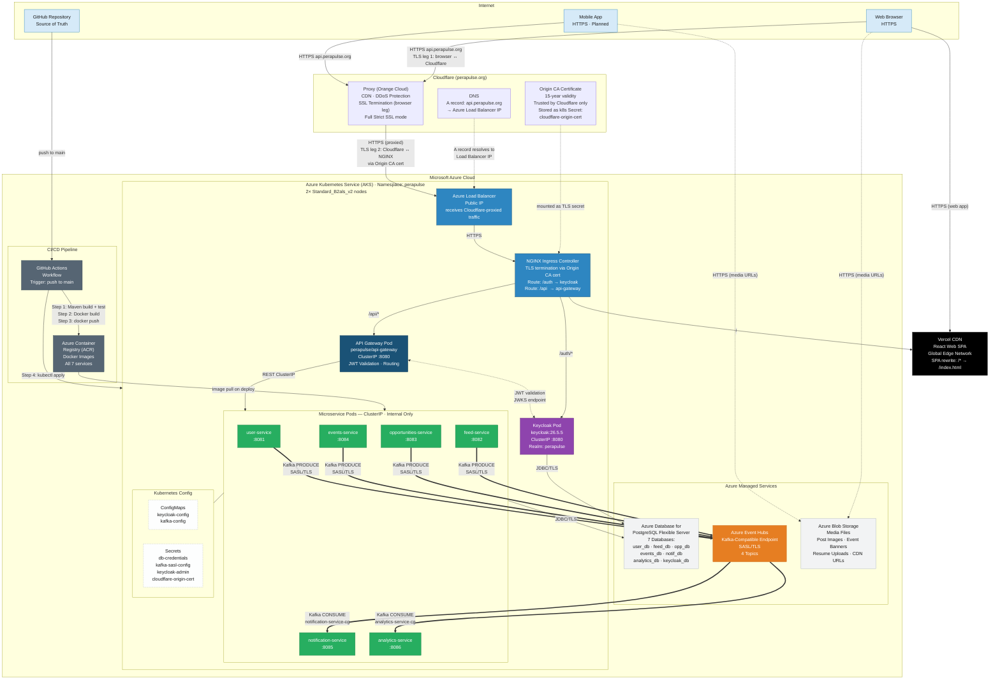
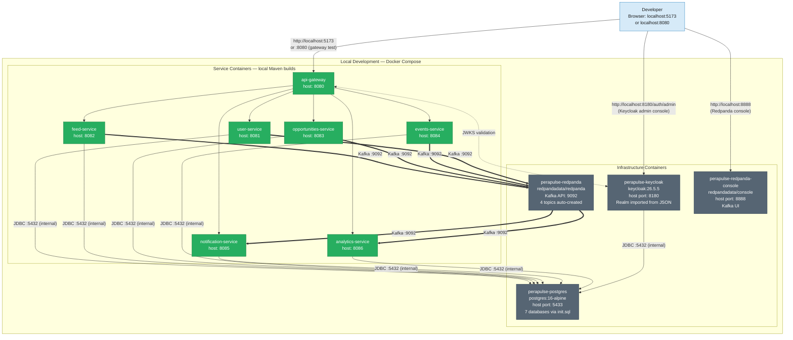
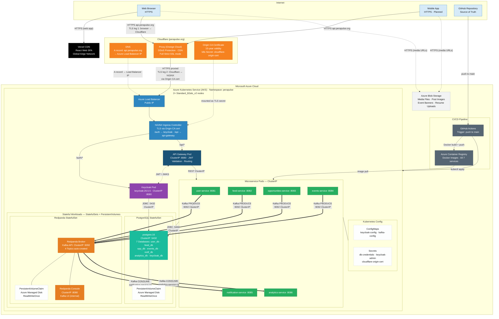

# Diagram 4 — Deployment Diagram: Cloud, Database & Infrastructure

> Shows the full cloud topology (Azure production environment), local development environment (Docker Compose), CI/CD pipeline, and the comparison between the two environments.

## 4A — Production: Azure Cloud Deployment



*Figure 4a: Production Cloud Deployment Architecture of PeraPulse on Microsoft Azure, showing the Cloudflare DNS and reverse proxy layer (Full Strict SSL with Origin CA certificate), Azure Kubernetes Service cluster internals (NGINX Ingress, API Gateway, seven microservice pods, Kubernetes Secrets and ConfigMaps), and Azure managed services (PostgreSQL Flexible Server, Event Hubs, Blob Storage, Container Registry), with Vercel CDN serving the web frontend and GitHub Actions driving the CI/CD pipeline.*

---

## 4B — Local Development: Docker Compose



*Figure 4b: Local Development Environment of PeraPulse using Docker Compose, showing all infrastructure containers (PostgreSQL, Keycloak, Redpanda, Redpanda Console) and microservice containers running on a shared bridge network with direct port mappings, using Redpanda as a Kafka-compatible message broker in place of Azure Event Hubs.*

---

## 4C — Production: AKS Self-Hosted (PostgreSQL + Redpanda in-cluster)

> Same Cloudflare → AKS entry path as 4A, but PostgreSQL and Redpanda run as StatefulSets inside the cluster instead of using Azure managed services. This is the actual real-world deployment of PeraPulse.



*Figure 4c: Real-world AKS Self-Hosted Deployment of PeraPulse, where both PostgreSQL (StatefulSet, 7 databases) and Redpanda (StatefulSet, Kafka-compatible broker) run as in-cluster workloads backed by Azure Managed Disk PersistentVolumeClaims, eliminating the dependency on Azure Event Hubs and Azure PostgreSQL Flexible Server while retaining the Cloudflare reverse proxy, NGINX Ingress, and Azure Blob Storage for media.*

---

## Cloudflare SSL/TLS Architecture

Cloudflare **Full (strict)** SSL mode creates two independent encrypted legs:

```
Browser ──[TLS leg 1: Cloudflare's public cert]──► Cloudflare Proxy
                                                          │
                                         [TLS leg 2: Origin CA cert]
                                                          │
                                                          ▼
                                    Azure Load Balancer → NGINX Ingress
                                    (terminates with cloudflare-origin-cert k8s Secret)
```

| SSL Leg | Certificate | Issued By | Trusted By |
|---------|------------|-----------|------------|
| Browser ↔ Cloudflare | Cloudflare-managed cert | Cloudflare / DigiCert | All browsers |
| Cloudflare ↔ AKS NGINX | Origin CA cert (15-year) | Cloudflare Origin CA | Cloudflare only |

The Origin CA certificate is stored as a Kubernetes TLS secret (`cloudflare-origin-cert`) and referenced in `infra/k8s/ingress/ingress.yaml`. It never needs renewal for the lifetime of the project.

> **Why DNS-only (grey cloud) first?** The deployment guide configures DNS-only initially so that Keycloak's JWT issuer URL (`api.perapulse.org`) resolves correctly before enabling the proxy. The orange cloud (proxy mode) is enabled after Keycloak is healthy.

---

## Environment Comparison

| Component | Local Dev (4B) | AKS Managed (4A) | AKS Self-Hosted (4C — real) |
|-----------|---------------|-----------------|----------------------------|
| **Orchestration** | Docker Compose | AKS | AKS |
| **Kafka Broker** | Redpanda container | Azure Event Hubs (managed) | Redpanda StatefulSet in-cluster |
| **Database** | PostgreSQL container (port 5433) | Azure PostgreSQL Flexible Server | PostgreSQL StatefulSet in-cluster |
| **DB Storage** | Docker volume | Azure managed disks (transparent) | Azure Managed Disk PVC |
| **Auth** | Keycloak in Docker (port 8180) | Keycloak pod (ClusterIP :8080) | Keycloak pod (ClusterIP :8080) |
| **DNS** | localhost / hosts file | Cloudflare DNS (api.perapulse.org) | Cloudflare DNS (api.perapulse.org) |
| **CDN / Proxy** | None | Cloudflare Proxy — DDoS, caching | Cloudflare Proxy — DDoS, caching |
| **TLS/HTTPS** | No (HTTP on localhost) | Full strict: Cloudflare + Origin CA | Full strict: Cloudflare + Origin CA |
| **Ingress** | Direct port mapping | NGINX Ingress + Azure Load Balancer | NGINX Ingress + Azure Load Balancer |
| **Web Frontend** | Vite dev server (port 5173) | Vercel CDN (global edge) | Vercel CDN (global edge) |
| **Media Storage** | Not implemented | Azure Blob Storage | Azure Blob Storage |
| **Service Discovery** | Docker DNS (container names) | Kubernetes DNS (ClusterIP) | Kubernetes DNS (ClusterIP) |
| **Image Registry** | Local Docker daemon | Azure Container Registry (ACR) | Azure Container Registry (ACR) |
| **CI/CD** | Manual `mvn spring-boot:run` | GitHub Actions → ACR → AKS | GitHub Actions → ACR → AKS |

---

## Scalability Design

| Concern | Current Approach | Scale Path |
|---------|-----------------|-----------|
| **Service instances** | 1 pod per service | Kubernetes HPA (Horizontal Pod Autoscaler) |
| **Database** | Shared PostgreSQL pod | Migrate each DB to Azure PostgreSQL Flexible Server (independent scaling) |
| **Message broker** | Redpanda (dev) → Azure Event Hubs (prod) | Event Hubs partitions scale with throughput |
| **Frontend** | Vercel CDN | Already globally distributed, no changes needed |
| **Auth (Keycloak)** | Single pod | Keycloak HA mode with shared DB or migrate to Azure AD B2C |
| **Statelessness** | All services are JWT-stateless | Horizontal scale with no session affinity required |
| **Media storage** | Azure Blob + CDN | Azure CDN scales automatically |

---

## Local Dev Access Points

```
http://localhost:8080           → API Gateway (all API routes)
http://localhost:8180/auth      → Keycloak (via direct access)
http://localhost:8180/auth/admin → Keycloak Admin Console
http://localhost:8888           → Redpanda Console (Kafka UI)
http://localhost:5173           → React Web App (Vite dev server)
http://localhost:8081/swagger-ui.html → User Service Swagger
http://localhost:8082/swagger-ui.html → Feed Service Swagger
http://localhost:8083/swagger-ui.html → Opportunities Service Swagger
http://localhost:8084/swagger-ui.html → Events Service Swagger
http://localhost:8085/swagger-ui.html → Notification Service Swagger
http://localhost:8086/swagger-ui.html → Analytics Service Swagger
```
